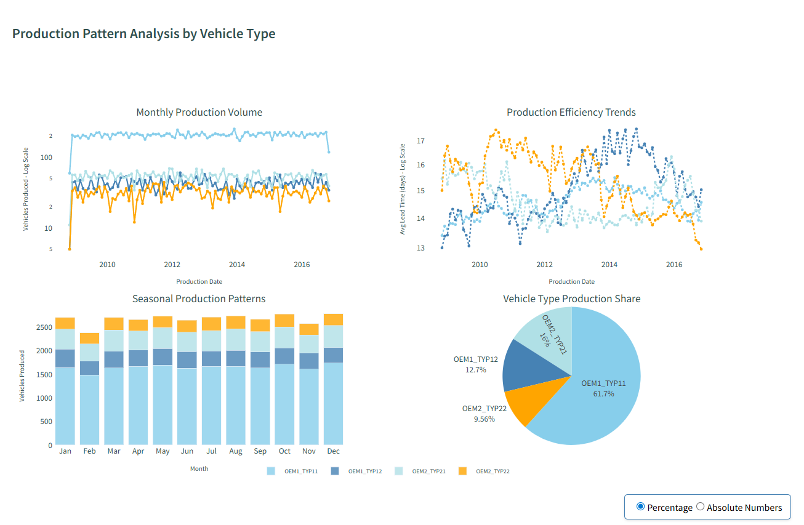

# Automotive Production Lead Time Analysis Dashboard

[](https://python.org)
[](https://dash.plotly.com)
[](https://plotly.com)
[](https://pandas.pydata.org)
[](https://scikit-learn.org)
[](https://jupyter.org)
[](https://numpy.org)
[](https://scipy.org)

## Project Overview

This project analyzes production lead times for a large automotive company manufacturing vehicles under two brands: **OEM1** and **OEM2**. The goal is to identify vehicle types with extended production cycles and optimize the supply chain from parts suppliers to final vehicle assembly.

### Business Objectives:
- Identify vehicle types with problematic lead times
- Analyze production bottlenecks across the supply chain
- Provide data-driven recommendations for process improvements

## Key Components

- `Case_Study_App_Group_40.py` - Interactive Dash dashboard
- `Final_dataset_group_40.csv` - Processed production data
- `General_Tasks_Group_40.ipynb` - Statistical analysis tasks

## Dashboard Features

### Interactive Analysis:
- **Lead Time Distribution**: Violin plots with 95th percentile analysis
- **Component Analysis**: Performance across Body, Engine, Transmission, Seats
- **Bottleneck Identification**: Part types causing most delays
- **Production Patterns**: Monthly trends and seasonal analysis
- **Factory Performance**: Plant-level efficiency metrics

### Key Metrics:
- **Vehicle Lead Time** = Vehicle Production Date - Latest Component Production Date
- **Component Lead Time** = Latest Part Date - Earliest Part Date
- **Total Lead Time** = Sum of all component lead times

## Dashboard Screenshots

### Main Dashboard Interface


### Interactive Analytics Panel


## Analysis Results

### Key Findings:

**Lead Time Performance:**
- Average lead time varies significantly across vehicle types
- 95th percentile analysis reveals ~5% of vehicles require management attention
- Component-specific bottlenecks identified in Body, Engine, Transmission, and Seats

**Bottleneck Analysis:**
- Specific part types (1-40) consistently cause production delays
- Factory performance varies by manufacturer (first 3 digits of plant code)
- Seasonal patterns affect both production volume and efficiency

**Manufacturing Insights:**
- OEM1 vs OEM2 show different operational efficiency profiles
- Monthly production patterns reveal optimization opportunities
- Critical cases table identifies top 100 vehicles needing immediate attention

## Business Recommendations

1. **Target High-Impact Vehicle Types**: Focus improvement efforts on consistently problematic vehicle variants
2. **Component Optimization**: Address specific component bottlenecks identified through analysis
3. **Factory Performance**: Improve underperforming plants based on lead time metrics
4. **Supply Chain Coordination**: Better synchronization between suppliers based on seasonal patterns

## Technologies Used

- **Python 3.8+**: Core programming language
- **Dash**: Interactive web application framework for dashboard
- **Plotly**: Interactive data visualization library
- **Pandas**: Data manipulation and analysis
- **NumPy**: Numerical computing and array operations
- **Scikit-learn**: Machine learning algorithms for classification
- **Matplotlib**: Statistical plotting and visualization
- **SciPy**: Scientific computing and statistical analysis
- **Jupyter Notebooks**: Interactive data analysis and exploration

## Quick Start

### Prerequisites
```bash
# Ensure Python 3.8+ is installed
python --version
```

### Installation
```bash
# Install required dependencies
pip install -r requirements.txt

# Or install manually
pip install pandas plotly dash numpy scikit-learn matplotlib scipy jupyter
```

### Running the Dashboard
```bash
# Navigate to project directory
cd "Automotive Production Lead Time Analysis"

# Run the interactive dashboard
python Case_Study_App_Group_40.py

# Access the dashboard at: http://127.0.0.1:8050/
```

### Running Jupyter Analysis
```bash
# Start Jupyter Notebook
jupyter notebook

# Open and run: General_Tasks_Group_40.ipynb
```

**Requirements**: `Final_dataset_group_40.csv` must be in project root directory.

---
*IDA Case Study Group 40 - SoSe24*